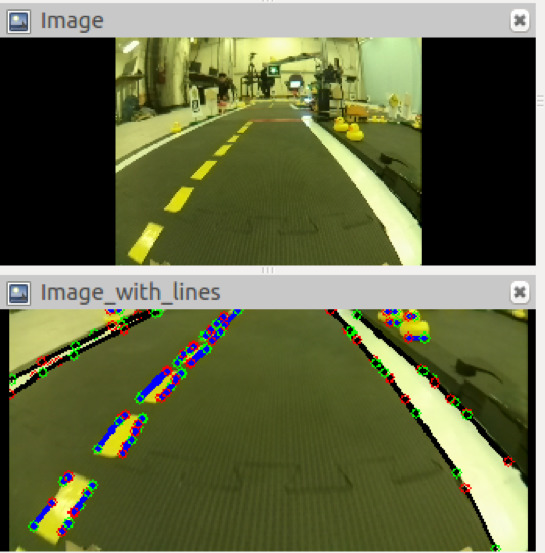

# Package `line_detector2` {#line_detector2}

<move-here src='#line_detector2-autogenerated'/>

This is a re-implementation of the package [`line_detector`](#line_detector)
using the new facilities provided by [`easy_node`](+code_docs#easy_node).

## Testing the line detector using visual inspection

The following are instructions to test the line detector from
bag files.

You can run from a bag with the following:

    laptop $ roslaunch line_detector line_detector_bag.launch veh:=![vehicle] bagin:=![bag in] bagout:=![bag out] verbose:=true

Where:

* `![bag in]` is the **absolute path** of the input bag.
* `![vehicle]` is the name of the vehicle that took the log.
* `![bag out]` is the **absolute path** if the output bag.

Note: you always need to use absolute paths for bag files.

You can let this run for a few seconds, then stop using <kbd>Ctrl</kbd>-<kbd>C</kbd>.

You can then inspect the result using:

    $ roscore &
    $ rosbag play -l ![bag out]
    $ rviz &

In `rviz` click "add", click "by topic" tab, expand "`line_detector`" and click
"`image_with_lines`".

Observe on the result that:

1. There are *lots* of detections.
2. Predominantly white detections (indicated in black) are on white lines, yellow detections (shown in blue) are on blue lines, and red detections (shown in green) are on red lines.

These are some sample logs on which to try:

    $ wget -O 160122-manual1_ferrari.bag https://www.dropbox.com/s/8bpi656j7qox5kv?dl=1

    https://www.dropbox.com/s/vwznjke4xvnhi9o/160122_manual2-ferrari.bag?dl=1

    https://www.dropbox.com/s/y7uljl98punj0mp/160122_manual3_corner-ferrari.bag?dl=1

    https://www.dropbox.com/s/d4n9otmlans4i62/160122-calibration-good_lighting-tesla.bag?dl=1

Sample output:

    From cmd:roslaunch duckietown camera.launch veh:=${VEHICLE_NAME}
    [INFO] [WallTime: 1453839555.948481] [LineDetectorNode] number of white lines = 14
    [INFO] [WallTime: 1453839555.949102] [LineDetectorNode] number of yellow lines = 33
    [INFO] [WallTime: 1453839555.986520] [LineDetectorNode] number of white lines = 18
    [INFO] [WallTime: 1453839555.987039] [LineDetectorNode] number of yellow lines = 34
    [INFO] [WallTime: 1453839556.013252] [LineDetectorNode] number of white lines = 14
    [INFO] [WallTime: 1453839556.013857] [LineDetectorNode] number of yellow lines = 29
    [INFO] [WallTime: 1453839556.014539] [LineDetectorNode] number of red lines = 2
    [INFO] [WallTime: 1453839556.047944] [LineDetectorNode] number of white lines = 18
    [INFO] [WallTime: 1453839556.048672] [LineDetectorNode] number of yellow lines = 28
    [INFO] [WallTime: 1453839556.049534] [LineDetectorNode] number of red lines = 2
    [INFO] [WallTime: 1453839556.081400] [LineDetectorNode] number of white lines = 13
    [INFO] [WallTime: 1453839556.081944] [LineDetectorNode] number of yellow lines = 34
    [INFO] [WallTime: 1453839556.082479] [LineDetectorNode] number of red lines = 1

The output from `rviz` looks like .

    

## Quantitative tests

TODO: Something more quantitative (to be filled in by Liam or Hang)

## `line_detector_node2` {#line_detector2-line_detector_node2}

<move-here src="#line_detector2-line_detector_node2-autogenerated"/>
